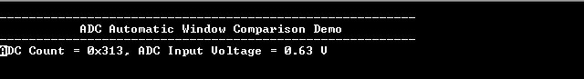

# ADC automatic window comparison

This example application shows how to sample an analog input in polled mode and send the converted data to console using automatic window comparison of converted values.

## Description

This example application shows how to use the ADC Peripheral library to perform automatic window comparison of converted values.

The ADC peripheral is configured to operate in window mode. In this example, Analog input voltage in the range of 0 V to 3.3 V is fed to the ADC input channel AD0. The ADC conversion is triggered by software and converted result is displayed on the console whenever input voltage goes below window lower threshold.

## Downloading and building the application

To clone or download this application from Github, go to the [main page of this repository](https://github.com/Microchip-MPLAB-Harmony/csp_apps_sam_9x60) and then click Clone button to clone this repository or download as zip file.
This content can also be downloaded using content manager by following these [instructions](https://github.com/Microchip-MPLAB-Harmony/contentmanager/wiki).

Path of the application within the repository is **apps/adc/adc_automatic_window_comparison/firmware** .

To build the application, refer to the following table and open the project using its IDE.

| Project Name      | Description                                    |
| ----------------- | ---------------------------------------------- |
| sam_9x60_curiosity.X | MPLABX project for [SAM9X60 Curiosity Development Board](https://www.microchip.com/en-us/development-tool/EV40E67A) |
|||

## Setting up AT91Bootstrap loader

To load the application binary onto the target device, we need to use at91bootstrap loader. Refer to the [at91bootstrap loader documentation](../../docs/readme_bootstrap.md) for details on how to configure, build and run bootstrap loader project and use it to bootstrap the application binaries.

## Setting up the hardware

The following table shows the target hardware for the application projects.

| Project Name| Board|
|:---------|:---------:|
| sam_9x60_curiosity.X | [SAM9X60 Curiosity Development Board](https://www.microchip.com/en-us/development-tool/EV40E67A) |
|||

### Setting up [SAM9X60 Curiosity Development Board](https://www.microchip.com/en-us/development-tool/EV40E67A)

#### Setting up the board

- Connect a programming cable from JTAG connector J12 on board to programmer(J-32 Debugger).
- Connect programmer(J-32 Debugger) to computer using a micro USB cable. 
- Connect the USB port J1 on board to the computer using a micro USB cable (to power the board).
- Use a jumper wire to connect Pin 29 of J9 (AD0 is mapped to Port Pin PB11) to 3.3 V or GND (OR Use Potentiometer to vary input voltage from GND to 3.3 V and vice-versa)
- Connect a FTDI cable from J11 connector to computer.

## Running the Application

1. Open the Terminal application (Ex.:Tera term) on the computer.
2. Connect to the EDBG/Jlink Virtual COM port and configure the serial settings as follows:
    - Baud : 115200
    - Data : 8 Bits
    - Parity : None
    - Stop : 1 Bit
    - Flow Control : None
3. Build and program the application using its IDE
4. Console displays ADC Count and ADC Input Voltage whenever input voltage goes below lower window threshold value (output is not updated on console, if the values are within the threshold)

    

    *NOTE: Image provided in above step is for illustration purpose only. ADC count and ADC Input voltage are printed on the console whenever input voltage goes below 2.417 V ((3000/4095) &ast; 3.3V)*