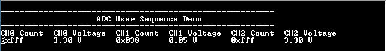

# ADC user sequence

This example application shows how to sample three analog inputs using the user sequencer in software trigger mode and send the converted data to the console.

## Description

Conversion of the three analog inputs is triggered from software trigger at every 500 ms. The user sequencer is used to define the order of conversion:

| Board | Sequence of conversion |
| ----- | ---------------------- |
| [SAM9X60-EK Evaluation Kit](https://www.microchip.com/developmenttools/ProductDetails/DT100126) |  AD2 --> AD0 --> AD1 |
|||

Analog input voltage in the range of 0 V to 3.3 V is fed to the ADC input channel AD2, AD0 and AD1. ADC conversion result is displayed on the console.

## Downloading and building the application

To clone or download this application from Github, go to the [main page of this repository](https://github.com/Microchip-MPLAB-Harmony/csp_apps_sam_9x60) and then click Clone button to clone this repository or download as zip file.
This content can also be downloaded using content manager by following these [instructions](https://github.com/Microchip-MPLAB-Harmony/contentmanager/wiki).

Path of the application within the repository is **apps/adc/adc_user_sequence/firmware** .

To build the application, refer to the following table and open the project using its IDE.

| Project Name      | Description                                    |
| ----------------- | ---------------------------------------------- |
| sam_9x60_ek.X | MPLABX project for [SAM9X60-EK Evaluation Kit](https://www.microchip.com/developmenttools/ProductDetails/DT100126) |
| sam_9x60_ek_iar.IAR | IAR project for [SAM9X60-EK Evaluation Kit](https://www.microchip.com/developmenttools/ProductDetails/DT100126) |
|||

## Setting up AT91Bootstrap loader

To load the application binary onto the target device, we need to use at91bootstrap loader. Refer to the [at91bootstrap loader documentation](../../docs/readme_bootstrap.md) for details on how to configure, build and run bootstrap loader project and use it to bootstrap the application binaries.

## Setting up the hardware

The following table shows the target hardware for the application projects.

| Project Name| Board|
|:---------|:---------:|
| sam_9x60_ek.X   sam_9x60_ek_iar.IAR | [SAM9X60-EK Evaluation Kit](https://www.microchip.com/developmenttools/ProductDetails/DT100126) |
|||

### Setting up [SAM9X60-EK Evaluation Kit](https://www.microchip.com/developmenttools/ProductDetails/DT100126)

#### Addtional hardware required

- SD Card with FAT32 file system

#### Setting up the SD Card

- Download harmony MPU bootstrap loader from this [location](firmware/at91bootstrap_sam_9x60_ek.X/binaries/boot.bin)
- Copy the downloaded boot loader binary( boot.bin) onto the SD card

#### Setting up the board

- SDMMC slot used for bootloading the application is SDMMC0 (J4)
- Connect the USB port J22 on board to the computer using a micro USB cable (to enable debug com port)
- Connect the USB port J7 on board to the computer using a micro USB cable (to power the board)
- Use a jumper wire to connect Pin 32 of J16 (AD0 is mapped to Port Pin PB11) to 3.3 V or GND
- Use a jumper wire to connect Pin 33 of J16 (AD1 is mapped to Port Pin PB12) to 3.3 V or GND
- Use a jumper wire to connect Pin 31 of J16 (AD2 is mapped to Port Pin PB13) to 3.3 V or GND
- *NOTE - Reset push button is labelled as SW3*

## Running the Application

1. Build the application using its IDE
2. Copy the output binary (named 'harmony.bin') onto the SD Card (Refer to the 'Setting up hardware' section above for setting up the SD card)
3. Insert the SD card into SDMMC slot on the board (Refer to the 'Setting up hardware' section for the correct SDMMC slot)
4. Open the Terminal application (Ex.:Tera term) on the computer.
5. Connect to the EDBG/Jlink Virtual COM port and configure the serial settings as follows:
    - Baud : 115200
    - Data : 8 Bits
    - Parity : None
    - Stop : 1 Bit
    - Flow Control : None
6. Reset the board to run the application
7. The console displays the ADC Count and the ADC Input Voltage

