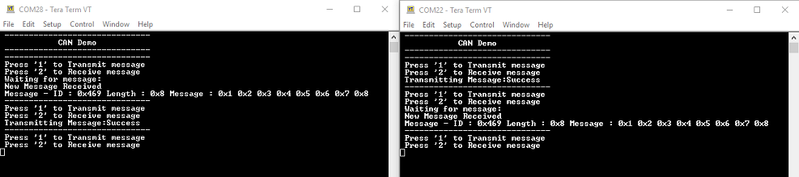

# CAN interrupt

This example application shows how to use the CAN module to transmit and receive CAN messages in interrupt mode.

## Description

This application transmits CAN FD message to CAN Bus and receives CAN FD message from CAN Bus. To run this application, two evaluation boards of same type are required. These boards acts as different nodes on the CAN bus. Same application is programmed onto both the boards. Boards are connected to PC via UART. While running the application, user can send and receive CAN FD messages between the boards using UART console applications running on the PC.

## Downloading and building the application

To clone or download this application from Github, go to the [main page of this repository](https://github.com/Microchip-MPLAB-Harmony/csp_apps_sam_9x60) and then click Clone button to clone this repository or download as zip file.
This content can also be downloaded using content manager by following these [instructions](https://github.com/Microchip-MPLAB-Harmony/contentmanager/wiki).

Path of the application within the repository is **apps/can/can_normal_operation_blocking/firmware** .

To build the application, refer to the following table and open the project using its IDE.

| Project Name      | Description                                    |
| ----------------- | ---------------------------------------------- |
| sam_9x60_ek.X | MPLABX project for [SAM9X60-EK Evaluation Kit](https://www.microchip.com/developmenttools/ProductDetails/DT100126) |
| sam_9x60_ek_iar.IAR | IAR project for [SAM9X60-EK Evaluation Kit](https://www.microchip.com/developmenttools/ProductDetails/DT100126) |
|||

## Setting up the hardware

The following table shows the target hardware for the application projects.

| Project Name| Board|
|:---------|:---------:|
| sam_9x60_ek.X   sam_9x60_ek_iar.IAR | [SAM9X60-EK Evaluation Kit](https://www.microchip.com/developmenttools/ProductDetails/DT100126) |
|||

### Setting up [SAM9X60-EK Evaluation Kit](https://www.microchip.com/developmenttools/ProductDetails/DT100126)

#### Addtional hardware required

- SD Card with FAT32 file system

#### Setting up the SD Card

- Download harmony MPU bootstrap loader from this [location](https://github.com/Microchip-MPLAB-Harmony/at91bootstrap/blob/sam9x60ek/boot.bin)
- Copy the downloaded boot loader binary( boot.bin) onto the SD card

#### Setting up the board

- SDMMC slot used for bootloading the application is SDMMC0 (J4)
- Connect SAM9X60-EK Evaluation Kit to another SAM9X60-EK Evaluation Kit as per the pin connections shown below

    | SAM9X60-EK - 1      | SAM9X60-EK - 2     |
    | ------------------  | ------------------ |
    | CAN_H, PIN 4 of J6  | CAN_H, PIN 4 of J6 |
    | CAN_L, PIN 4 of J6  | CAN_L, PIN 4 of J6 |
    | GND, PIN 4 of J6    | GND, PIN 4 of J6   |
    |||

- Connect the USB port J22 on each board to the computer using a micro USB cable (to enable debug com port)
- Connect the USB port J7 on each board to the computer using a micro USB cable (to power the board)
- *NOTE - Reset push button is labelled as SW3*

## Running the Application

1. Build the application using its IDE
2. Copy the output binary (named 'harmony.bin') onto the SD Cards (Refer to the 'Setting up hardware' section above for setting up the SD card)
3. Insert the SD card into SDMMC slot on the boards (Refer to the 'Setting up hardware' section for the correct SDMMC slot)
4. Open the Terminal application (Ex.:Tera term) on the computer.
5. Connect to the EDBG/Jlink Virtual COM ports associated with each board and configure the serial settings as follows:
    - Baud : 115200
    - Data : 8 Bits
    - Parity : None
    - Stop : 1 Bit
    - Flow Control : None
6. Reset the board to run the application
7. In the console associated with board 2, press "2" to receive a CAN message
8. In the console associated with board 1, press "1" to transmit a CAN  message
9. Transmitted message description and status will be displayed in the console window of board 1
10. Received message will be displayed in the console window of board 2
11. If the steps are executed in this sequence, the final output in the consoles will be as below (console on the left is the transmitter (board 1) and the one on the right is receiver (board 2)):

  
