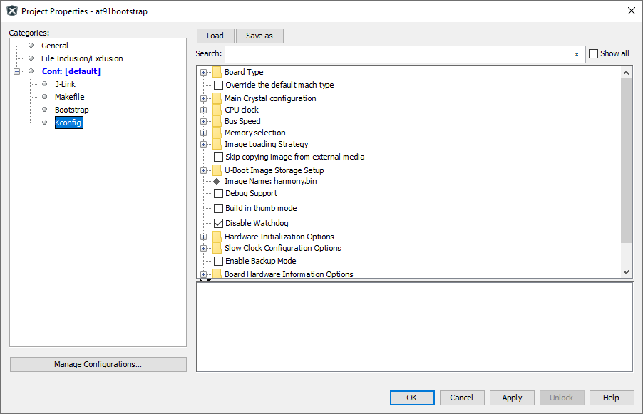
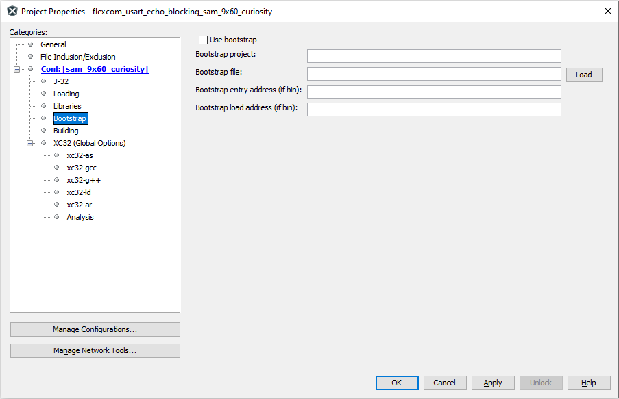
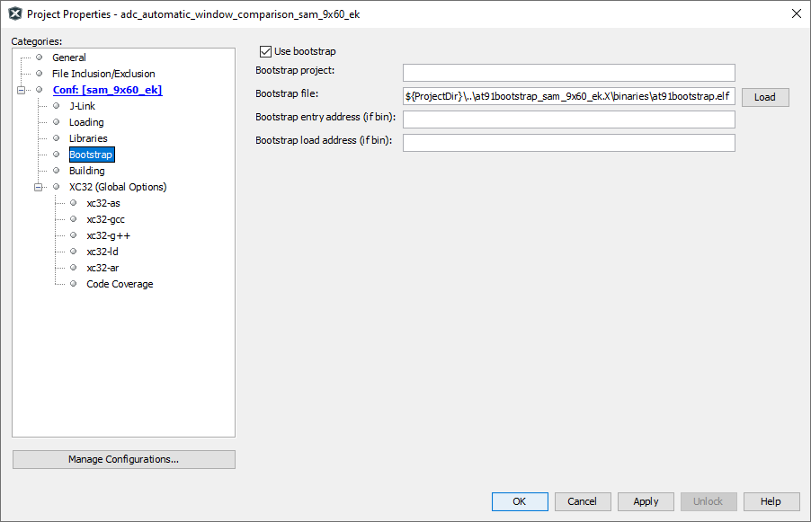

# Bootstrapping MPU applications using At91bootstrap loader

MPU applications are linked to execute from external DRAM memory that is available on the evaluation kit. This require all peripherals and clock leading to the DRAM memory to be configured prior to the application being programmed. This is done using a bootstrap loader.

Bootstrap loader project used for this purpose is a variant of the AT91Bootstrap project available for Microchip MPUs. It can be downloaded from [here](https://github.com/linux4sam/at91bootstrap/tree/at91bootstrap-3.x-mplabx). This project is adapted to be used from within MPLABx IDE on both Windows and Linux.

To facilitate the debugging and running of the MPU application, each application in this repository is bundled with its own copy of the AT91Bootstrap project. Each copy of the bootstrap project can be found under same folder as the application project and is named and is prefixed with "at91bootstrap_". For eg: if the application folder name is sam_9x60_ek.X, then bootstrap project folder will be named at91bootstrap_sam_9x60_ek.X and will be present at the same folder level.

Bootstrap project is configured to load and execute a raw binary file named "harmony.bin" from the SD card. SD card slot to be used shall vary with the evaluation kit.

Each application project is configured with a post build step which will generate the necessary binary file named "harmony.bin" at the end of each build.

If you are only interested in running or debugging the MPU applications in this repository , you can skip the following sections and  and jump straight to [Debugging MPU application using MPLABx](#debugging-mpu-applications-using-mplabx). Each copy of the bootstrap project in this repository is preconfigured to the correct evaluation kit.Also, the bootstrap binary files required to program and run the  applications are checked into the repository.

## Building AT91Bootstrap project

- Bootstrap project can be configured using MPLABx using its KCONFIG menu. To do this, open the project in MPLABx, right click on the project and select  "properties". In categories, select "Kconfig" as shown below:

    

- Click on "LOAD" button and navigate to the boards folder inside the project. Choose the a  default configuration file (defconfig) config file to select a target evaluation board and boot method
  - For eg: If you want to boot harmony.bin file from sd card for SAM9X60 evaluation kit, navigate to board/sam9x60ek folder and select "sam9x60eksd_harmony_defconfig" file

- Click on "Apply" and "OK" buttons to configure the project

- Build the project to generate the bootstrap binaries

- *Note: At91bootstrap project requires arm-gcc to build it. XC32 toolchain is not supported yet*

## Configure MPLABx application to use AT91Bootstrap loader

MPLABx debugger relies on AT91Bootstrap to configure the board before programming the application binaries. To configure an application to use AT91Bootstrap, follow the steps detailed below:

### Configure a debug tool

- Right click on the application project and select properties. This will open the properties window. In the configuration option --> connected hardware tools, select the debugger.

    

    *Note: if no debugger is connected, click on the "show all" check box and select the supported debugger. Only Jlink options are supported*

- Select the target toolchain and click on apply to save the changes

- This will result in an additional menu option to be available in the configuration tree view called "bootstrap" as shown below:

    

### Configure bootstrap

- Click on "Use bootstrap" check box to enable bootstrap support

- Click on the "LOAD" button to load the bootstrap file. This will open a file picker, which allows you to choose the bootstrap binary file.

- Navigate to the "binaries" folder under the AT91Bootstrap project folder. This contains the build output of the  bootstrap project. You can either choose the "AT91Bootstrap.elf" file or "boot.bin" file
  - If ELF file is choosen, the "Bootstrap entry address" and the "Bootstrap load address" text box can be left empty as this information can be read from the ELF file
  - If BIN file is chosen, the bootstrap entry address and the load address should be filled in their corresponding text boxes
  - An example configuration can be seen below. Here a relative path is used with respect to the project directory, to make the configuration portable

      

## Debugging MPU applications using MPLABx

Once the applicaton is configured to use bootstrap loader, debugging the application is as simple right clicking the application and selecting "Debug" option. This will cause debugger to perform a two stage loading:

**Stage 1:** Loads the bootstrap loader into the internal SRAM and executes it. This will configure the board specific peripherals and memory

**Stage 2:** Loads the application into the external DRAM and debugs it. User can perform actions like setting breakpoints, single-stepping etc.

Debugging the applicaton using MPLABx has the following limitations:

1. Running application using debugger is not supported
2. Call stack is not supported
3. Step in, step out using debugger does not work

*Note:* Make sure that you reset the board between each debug sessions so that the debugger can attach to the target correctly

## Running MPU applications

To run the applications, copy both the application binary named "harmony.bin" and the bootstrap binary named "boot.bin" onto an SD card. Insert the SD card into the SD slot of the evaluation kit and press the reset button.

The ROM bootloader will copy the bootstrap binary "boot.bin" into the internal SRAM and executes it. The bootstrap will configure the external DRAM and the required peripherals, then copy the applicaton binary "harmony.bin" into the DRAM and executes it.
