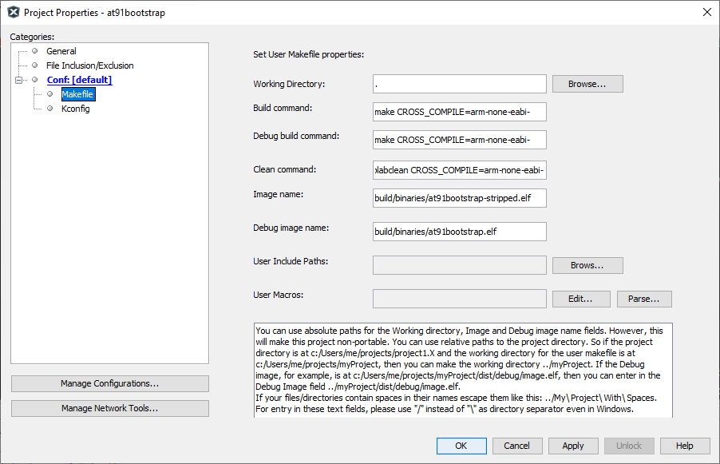
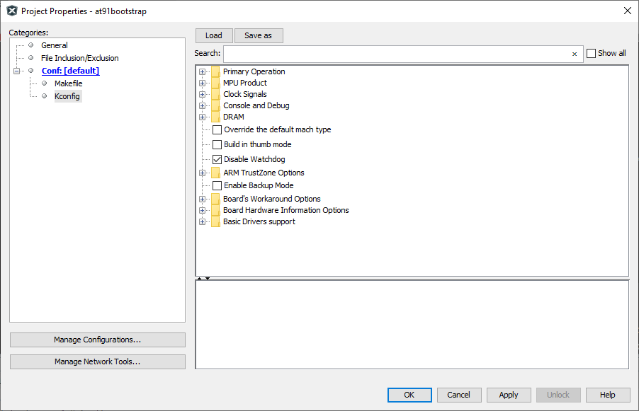
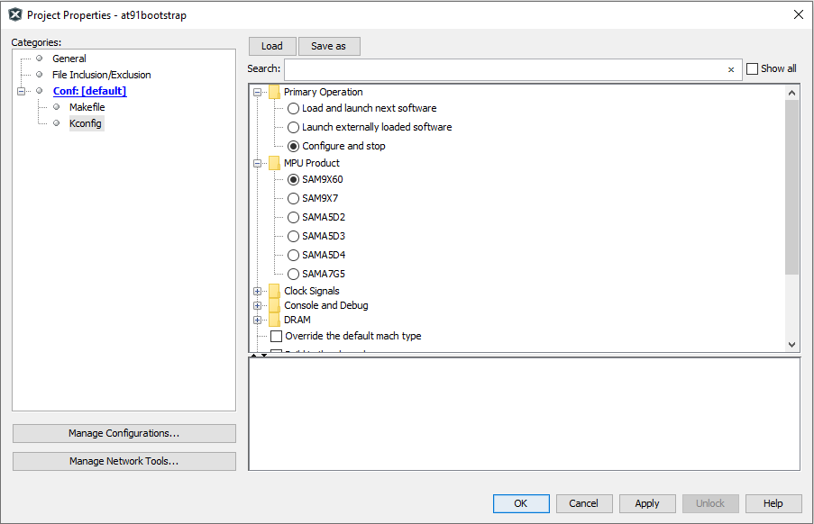

[](https://www.microchip.com)


# Building AT91Bootstrap project using MPLABx

- Open a console and execute the following command to clone at91bootstrap repository into a directory named at91bootstrap.X

    ```bash
    git clone https://github.com/linux4sam/at91bootstrap at91bootstrap.X
    ```
- Open at91bootstrap.X directory as project in MPLABx

## Configure compiler

- Open project properties window, and choose "Makefile" option to configure the compiler:

    

- Default option is configured to to use ARM gcc. To use xc32, replace all instances of arm-none-eabi- to xc32- as follows

    

*NOTE: For the build to be successful, the configured compiler should be available in the system path*

## Configure target

- Open project properties window, and choose "Kconfig" option to configure the build target:

    

- Click on "LOAD" button and navigate to the configs folder inside at91bootstrap.X directory. You need to choose the default configuration file(defconfig) based on what you need the at91boostrap to do

  **Debug/Run application from within MPLABx**

  - Load *{evaluation_kit}_bkpt_none_defconfig*. For example, on SAM9X60 Curiosity Board, select **sam9x60_curiosity_bkptnone_defconfig** as the configuration file

  - Click on "Apply" and "OK" buttons to configure the project

    

  - You can see that the MPU product is now selected as "SAM9X60" and the primary operation is selected as "Configure and Stop"

  **Load and Run application from an SD card**

  - Load *{evaluation_kit}sd_uboot_defconfig*. For example, on SAM9X60 Curiosity Board, select **sam9x60_curiositysd_uboot_defconfig** as the configuration file

  - Click on "Apply" and "OK" buttons to configure the project

    

  - You can see that the MPU product is now selected as "SAM9X60" and the primary operation is selected as "Load and launch next software"

  - Edit the Option "Next Software Image File Name" from *u-boot.bin* to *harmony.bin*

    

## Build target

Once the target configuration is applied in the properties window, you can build the at91boostrap just like any other MPLABx project. After the build is complete, you can find the generated binary files under build/binaries directory.