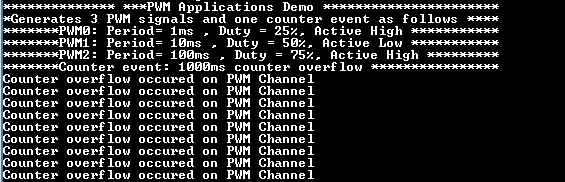

# PWM channels

This example demonstrates how to use the PWM peripheral to generate PWM signals.

## Description

This example shows how to configure the PWM to generate PWM signals whose duty and period can be configured independently.

## Downloading and building the application

To clone or download this application from Github, go to the [main page of this repository](https://github.com/Microchip-MPLAB-Harmony/csp_apps_sam_9x60) and then click Clone button to clone this repository or download as zip file.
This content can also be downloaded using content manager by following these [instructions](https://github.com/Microchip-MPLAB-Harmony/contentmanager/wiki).

Path of the application within the repository is **apps/pwm/pwm_channels/firmware** .

To build the application, refer to the following table and open the project using its IDE.

| Project Name      | Description                                    |
| ----------------- | ---------------------------------------------- |
| sam_9x60_ek.X | MPLABX project for [SAM9X60-EK Evaluation Kit](https://www.microchip.com/developmenttools/ProductDetails/DT100126) |
| sam_9x60_ek_iar.IAR | IAR project for [SAM9X60-EK Evaluation Kit](https://www.microchip.com/developmenttools/ProductDetails/DT100126) |
|||

## Setting up the hardware

The following table shows the target hardware for the application projects.

| Project Name| Board|
|:---------|:---------:|
| sam_9x60_ek.X   sam_9x60_ek_iar.IAR | [SAM9X60-EK Evaluation Kit](https://www.microchip.com/developmenttools/ProductDetails/DT100126) |
|||

### Setting up [SAM9X60-EK Evaluation Kit](https://www.microchip.com/developmenttools/ProductDetails/DT100126)

#### Addtional hardware required

- SD Card with FAT32 file system

#### Setting up the SD Card

- Download harmony MPU bootstrap loader from this [location](https://github.com/Microchip-MPLAB-Harmony/at91bootstrap/blob/sam9x60ek/boot.bin)
- Copy the downloaded boot loader binary( boot.bin) onto the SD card

#### Setting up the board

- SDMMC slot used for bootloading the application is SDMMC0 (J4)
- Connect the USB port J22 on board to the computer using a micro USB cable (to enable debug com port)
- Connect the USB port J7 on board to the computer using a micro USB cable (to power the board)
- Connect PB11 (PIN 32 of Connector J16) to an an oscilloscope/Logic analyzer
- Connect PB12 (PIN 33 of Connector J16) to an an oscilloscope/Logic analyzer
- Connect PB13 (PIN 31 of Connector J16) to an an oscilloscope/Logic analyzer
- *NOTE - Reset push button is labelled as SW3*

## Running the Application

1. Build the application using its IDE
2. Copy the output binary (named 'harmony.bin') onto the SD Card (Refer to the 'Setting up hardware' section above for setting up the SD card)
3. Insert the SD card into SDMMC slot on the board (Refer to the 'Setting up hardware' section for the correct SDMMC slot)
4. Open the Terminal application (Ex.:Tera term) on the computer.
5. Connect to the EDBG/Jlink Virtual COM port and configure the serial settings as follows:
    - Baud : 115200
    - Data : 8 Bits
    - Parity : None
    - Stop : 1 Bit
    - Flow Control : None
6. Reset the board to run the application
7. PWM0 generates an active high PWM signal with 1 ms period and 25% duty on PB11 (PIN 32 of connector J16)
8. PWM1 generates an active low PWM signal with 10 ms period and 50% duty on PB12 (PIN 33 of connector J16)
9. PWM2 generates an active high PWM signal with 100ms period and 75% duty on PB13 (PIN 31 of connector J 16)
10. Whenever a counter event occurs on PWM channel 4, console is upated as follows:

    

    *RGB_LED pulses with bluish white hue as all the three PWM signals are connected to the cathodes of the RGB LED*
