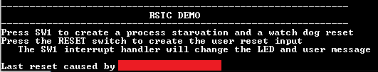
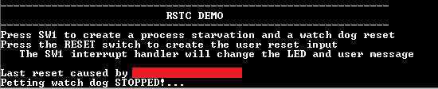
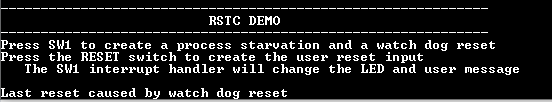
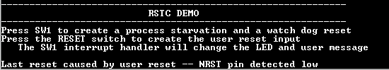

# RSTC reset cause

This example shows how to use the RSTC peripheral to indicate the cause of the device reset.

## Description

The Reset Controller collects the various reset sources and generates reset for the device and allows the reset source to be identified by the software.

- **Power On Reset**: The device contains a power-on-reset (POR) detector, which keeps the system reset until power is stable. This eliminates the need for external reset circuitry to guarantee stable operation when powering up the device.
- **VDDCORE Brown Out Reset**: BOD12 will reset the device if a voltage of 1.2 V or below is observed on the I/O pin supplying power to the MCU core (VDDCORE).
- **VDDANA Brown Out Reset**: BOD33 resets the device if the voltage on the VDDANA pin falls below a value configured by the SYSCTRL
- **Watchdog Reset**: The watchdog reset occurs when it times out
- **System Reset**: The System Reset Request is a software reset generated by the CPU when asserting the SYSRESETREQ bit located in the Reset Control register of the CPU
- **External Reset**: A external reset is generated when a low level is detected on the RESET pin

This example application uses the RSTC peripheral to indicate the user Reset and the Watchdog reset. The WDT reset is emulated by not feeding the watchdog on switch press.

## Downloading and building the application

To clone or download this application from Github, go to the [main page of this repository](https://github.com/Microchip-MPLAB-Harmony/csp_apps_sam_9x60) and then click Clone button to clone this repository or download as zip file.
This content can also be downloaded using content manager by following these [instructions](https://github.com/Microchip-MPLAB-Harmony/contentmanager/wiki).

Path of the application within the repository is **apps/rstc/rstc_reset_cause/firmware** .

To build the application, refer to the following table and open the project using its IDE.

| Project Name      | Description                                    |
| ----------------- | ---------------------------------------------- |
| sam_9x60_ek.X | MPLABX project for [SAM9X60-EK Evaluation Kit](https://www.microchip.com/developmenttools/ProductDetails/DT100126) |
| sam_9x60_ek_iar.IAR | IAR project for [SAM9X60-EK Evaluation Kit](https://www.microchip.com/developmenttools/ProductDetails/DT100126) |
|||

## Setting up AT91Bootstrap loader

To load the application binary onto the target device, we need to use at91bootstrap loader. Refer to the [at91bootstrap loader documentation](../../docs/readme_bootstrap.md) for details on how to configure, build and run bootstrap loader project and use it to bootstrap the application binaries.

## Setting up the hardware

The following table shows the target hardware for the application projects.

| Project Name| Board|
|:---------|:---------:|
| sam_9x60_ek.X   sam_9x60_ek_iar.IAR | [SAM9X60-EK Evaluation Kit](https://www.microchip.com/developmenttools/ProductDetails/DT100126) |
|||

### Setting up [SAM9X60-EK Evaluation Kit](https://www.microchip.com/developmenttools/ProductDetails/DT100126)

#### Addtional hardware required

- SD Card with FAT32 file system

#### Setting up the SD Card

- Download harmony MPU bootstrap loader from this [location](firmware/at91bootstrap_sam_9x60_ek.X/binaries/boot.bin)
- Copy the downloaded boot loader binary( boot.bin) onto the SD card

#### Setting up the board

- SDMMC slot used for bootloading the application is SDMMC0 (J4)
- Connect the USB port J22 on board to the computer using a micro USB cable (to enable debug com port)
- Connect the USB port J7 on board to the computer using a micro USB cable (to power the board)
- *NOTE - Reset push button is labelled as SW3*

## Running the Application

1. Build the application using its IDE
2. Copy the output binary (named 'harmony.bin') onto the SD Card (Refer to the 'Setting up hardware' section above for setting up the SD card)
3. Insert the SD card into SDMMC slot on the board (Refer to the 'Setting up hardware' section for the correct SDMMC slot)
4. Open the Terminal application (Ex.:Tera term) on the computer.
5. Connect to the EDBG/Jlink Virtual COM port and configure the serial settings as follows:
    - Baud : 115200
    - Data : 8 Bits
    - Parity : None
    - Stop : 1 Bit
    - Flow Control : None
6. Reset the board to run the application
7. RGB LED toggles in green color and console displays the following message

    

    *NOTE: The cause for last reset will differ based on initial user action and is blanked out to avoid confusion*

8. Press Switch SW1 to stop petting the watchdog
9. RGB LED to should start toggling in blue color and the console display should be updated as follows

    

10. After a few seconds board will reset and the demo will start again (RGB LED toggles in Green color)
11. Console shall display watchdog as the cause of reset

    

    *NOTE: Application and bootloader shares the same console . Since bootloader messages are not relevant to the application,they are not shown here.*

12. Press Switch SW3 to reset the board. Board will reset immediately and demo will start again (RGB LED toggles in Green color)
13. Console displays user as the cause of reset

    
