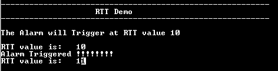

# RTT alarm interrupt

This example application shows how to use the RTT to generate alarm interrupt.

## Description

This example application shows how to configure alarm interrupt using the RTT Peripheral Library. The application sets up an alarm to be generated after 10 seconds. The application displays a message on the alarm trigger.

## Downloading and building the application

To clone or download this application from Github, go to the [main page of this repository](https://github.com/Microchip-MPLAB-Harmony/csp_apps_sam_9x60) and then click Clone button to clone this repository or download as zip file.
This content can also be downloaded using content manager by following these [instructions](https://github.com/Microchip-MPLAB-Harmony/contentmanager/wiki).

Path of the application within the repository is **apps/rtt/rtt_alarm/firmware** .

To build the application, refer to the following table and open the project using its IDE.

| Project Name      | Description                                    |
| ----------------- | ---------------------------------------------- |
| sam_9x60_curiosity.X | MPLABX project for [SAM9X60 Curiosity Development Board](https://www.microchip.com/en-us/development-tool/EV40E67A) |
|||

## Setting up the hardware

The following table shows the target hardware for the application projects.

| Project Name| Board|
|:---------|:---------:|
| sam_9x60_curiosity.X | [SAM9X60 Curiosity Development Board](https://www.microchip.com/en-us/development-tool/EV40E67A) |
|||

### Setting up [SAM9X60 Curiosity Development Board](https://www.microchip.com/en-us/development-tool/EV40E67A)

#### Setting up the board

- Connect a programming cable from JTAG connector J12 on board to programmer(J-32 Debugger).
- Connect programmer(J-32 Debugger) to computer using a micro USB cable. 
- Connect the USB port J1 on board to the computer using a micro USB cable (to power the board).

## Running the Application

1. Open the Terminal application (Ex.:Tera term) on the computer.
2. Connect to the USB Serial COM port and configure the serial settings as follows:
    - Baud : 115200
    - Data : 8 Bits
    - Parity : None
    - Stop : 1 Bit
    - Flow Control : None
3. Build and program the application using its IDE
4. The console displays RTT value and gets updated every second. Once the alarm value 10 is reached, it print the alarm message and turns on the LED.

    

Refer to the following table for LED name:

| Board      | LED Name                                    |
| ----------------- | ---------------------------------------------- |
| [SAM9X60 Curiosity Development Board](https://www.microchip.com/en-us/development-tool/EV40E67A) | RGB_LED(Green)  |
|||
